# note-taker

## Description

- Note Taker application allows the user to write and add notes, delete notes and retrieve all the notes created and saved by the user.
- The note data is added, retrieved and deleted from a JSON file and will use Express.js for backend.
- During this implementation, I was able to apply my knowledge on Express.js, API-HTML Routes, Different HTTP Requests, Modular routing, custom middleware , data persistance and deployment on Render.

## Table of Contents 

- [Installation](#installation)
- [User Story](#user-story)
- [Usage](#usage)
- [Usage & Tests](#usageandtest-screenshots-)
- [Acceptance Criteria](#acceptance-criteria)
- [Tests](#tests)
- [Credits](#credits)
- [License](#license)

## Installation

Follow these instructions to create your project and deploy the application to Render :

1. Create a new repository on your GitHub account and clone it to your computer.

2. When you're ready to deploy, use the git add, git commit, and git push commands to save and push your code to your GitHub repository.

3. To ensure that the node_modules folder is not pushed in the GITHUB, the .gitignore has to be updated and included.

3. Navigate to your Render.com - create New Web Service - Select Build and Deploy from a Git Repository

4. Connect to the respository created in above Steps 1 -2. (https://github.com/shwetakadam5/note-taker)

5. Provide Name of the webservice : (note-taker), Select Region : (Singapore), Branch : (main), Build Command : (npm i) , Start Command : (npm start), Auto-deploy : (Yes)

6. Once the settings are saved, the application is deployed and the published url will be (https://note-taker-kx8y.onrender.com)


## User-Story 
```
AS A small business owner
I WANT to be able to write and save notes
SO THAT I can organize my thoughts and keep track of tasks I need to complete
```

## Usage

**Link for the repository :** 

https://github.com/shwetakadam5/note-taker

**Link for the deployed application:**

https://note-taker-kx8y.onrender.com


## UsageAndTest Screenshots :

#### 1. ****Note Taker Appplication :Landing Page ****

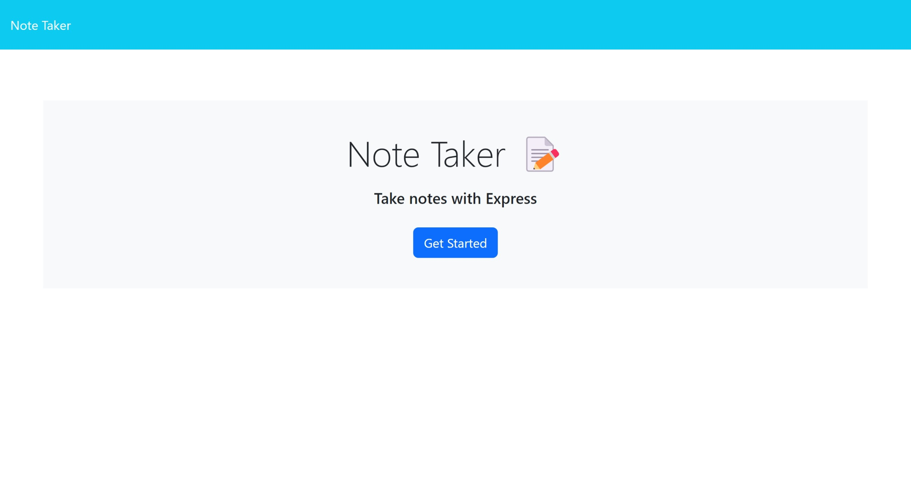 

#### 2. ****Note Taker Appplication :List of Notes and New Note Creation page ****

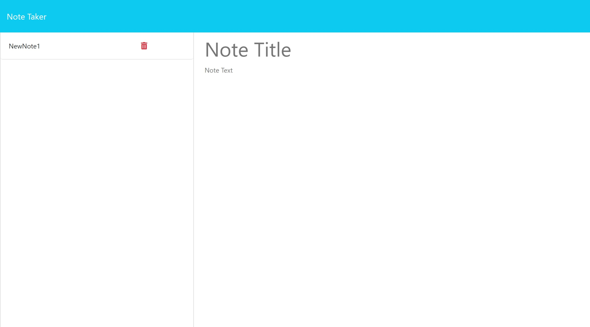 

#### 3. ****Note Taker Appplication : Display of Save and Clear On filling the note details ****

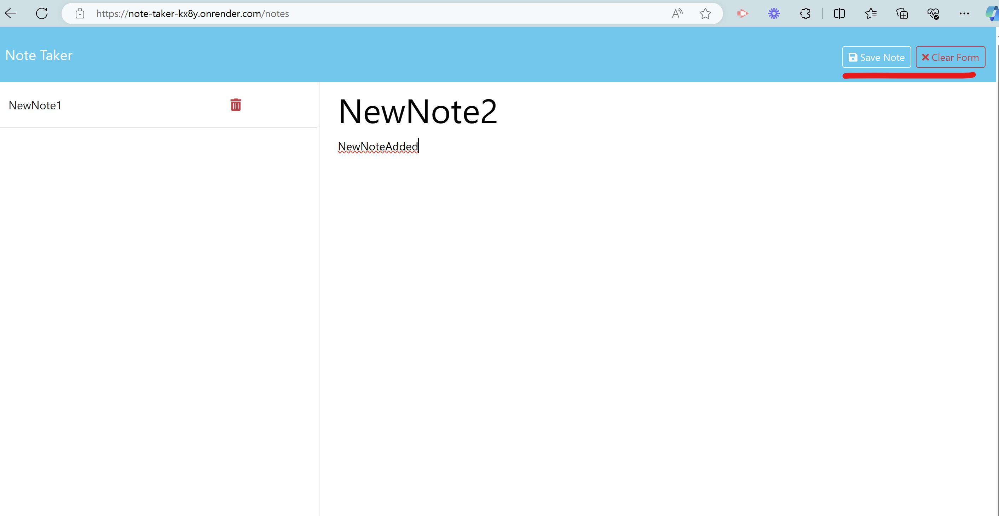 

#### 4. ****Note Taker Appplication : Display of Add Button on selecting the Note and selectednote details on right hand side****

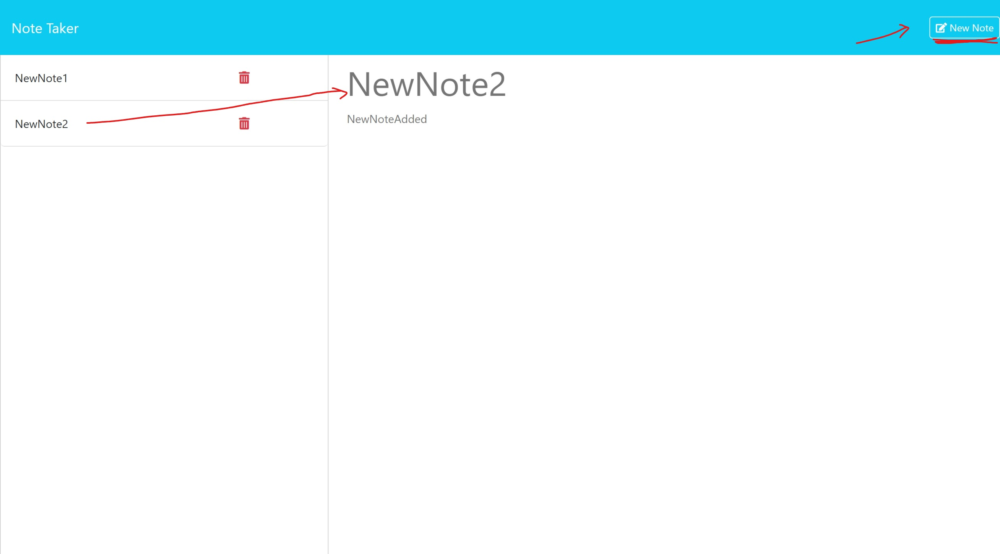 

#### 5. ****Note Taker Appplication :New Notes listed on the left hand side after post request ****

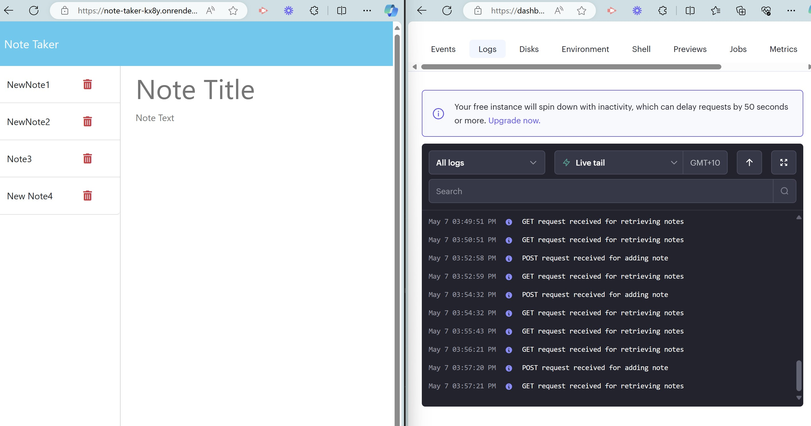 

#### 6. ****Note Taker Appplication :Delete Note  ****

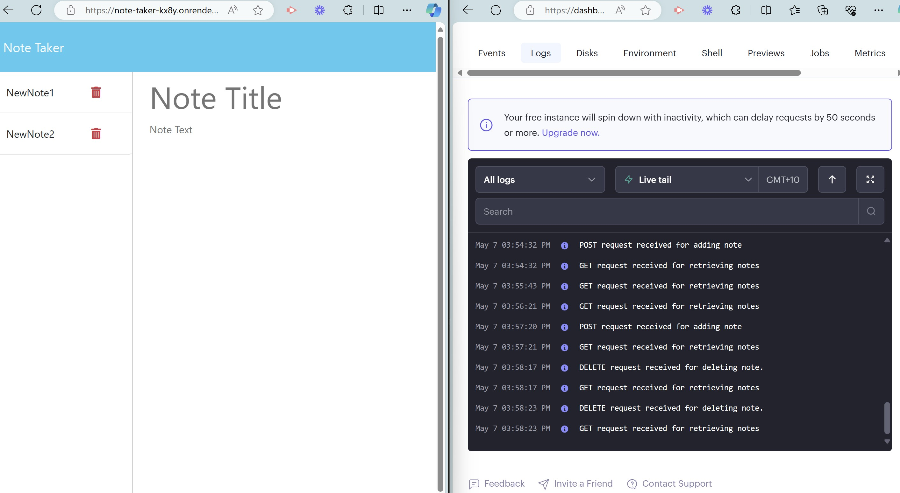 

#### 7. ****Note Taker Appplication :Error 1 : If user enters invalid request route****

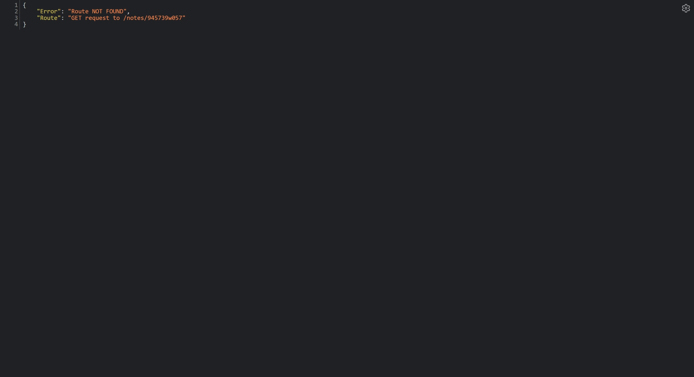 

#### 8. ****Note Taker Appplication :Error 2 : If user enters invalid ID to Delete****

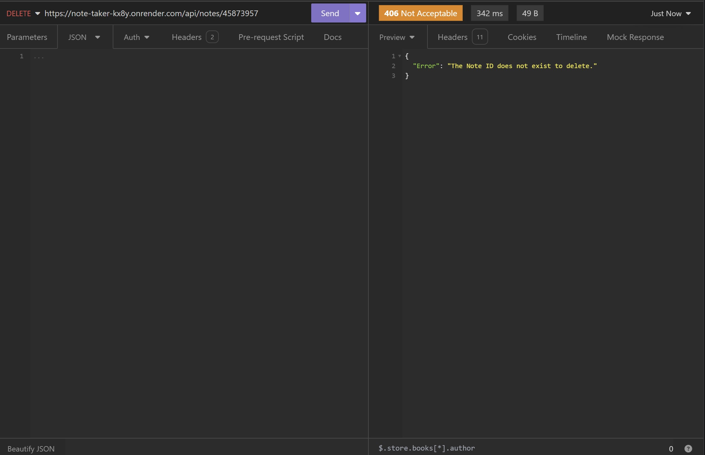 

#### 9. ****Note Taker Appplication :Error 3 : If User tries to post note without any request body****

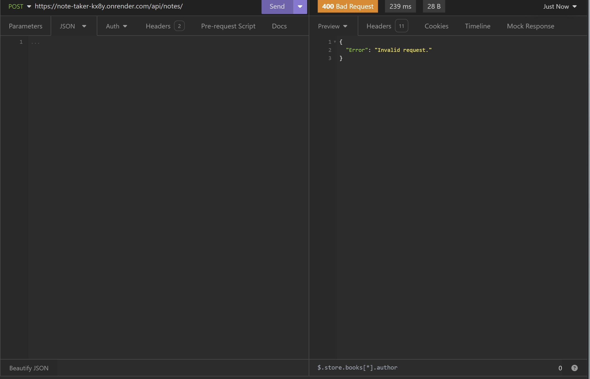 

#### 10. ****Note Taker Appplication :Error 4 : If User tries to post note with incomplete request JSON****

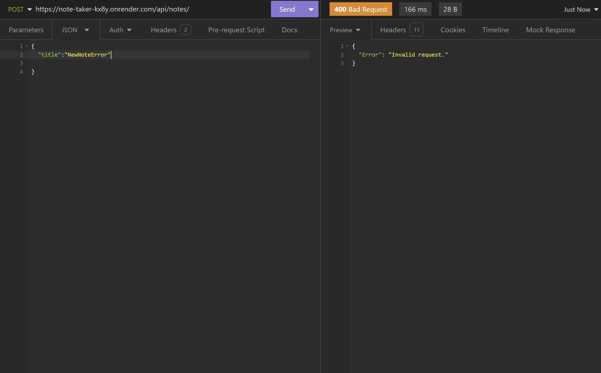 

#### 11. ****Note Taker Appplication :Message 1 : If the Note Creation is successful ****

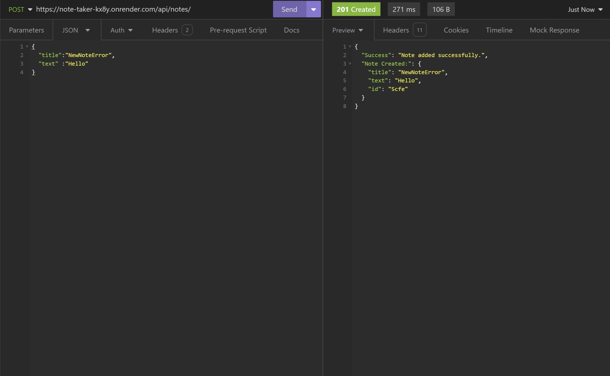 

#### 12. ****Note Taker Appplication :Message 2 : If the Note Deletion is successful****

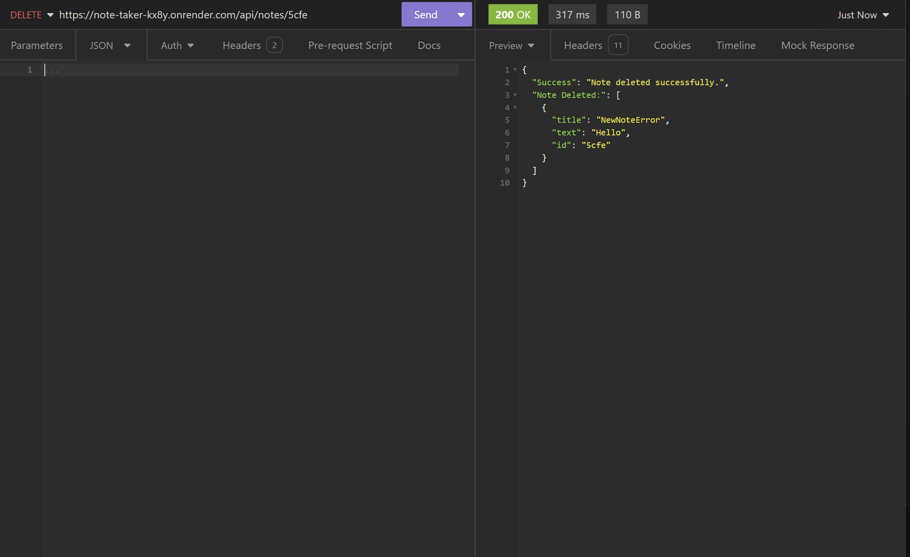 

## Acceptance-Criteria

```
GIVEN a note-taking application
WHEN I open the Note Taker
THEN I am presented with a landing page with a link to a notes page
WHEN I click on the link to the notes page
THEN I am presented with a page with existing notes listed in the left-hand column, plus empty fields to enter a new note title and the note’s text in the right-hand column
WHEN I enter a new note title and the note’s text
THEN a "Save Note" button and a "Clear Form" button appear in the navigation at the top of the page
WHEN I click on the Save button
THEN the new note I have entered is saved and appears in the left-hand column with the other existing notes and the buttons in the navigation disappear
WHEN I click on an existing note in the list in the left-hand column
THEN that note appears in the right-hand column and a "New Note" button appears in the navigation
WHEN I click on the "New Note" button in the navigation at the top of the page
THEN I am presented with empty fields to enter a new note title and the note’s text in the right-hand column and the button disappears
```

## Credits

https://expressjs.com/

https://expressjs.com/en/guide/routing.html

## License

MIT

